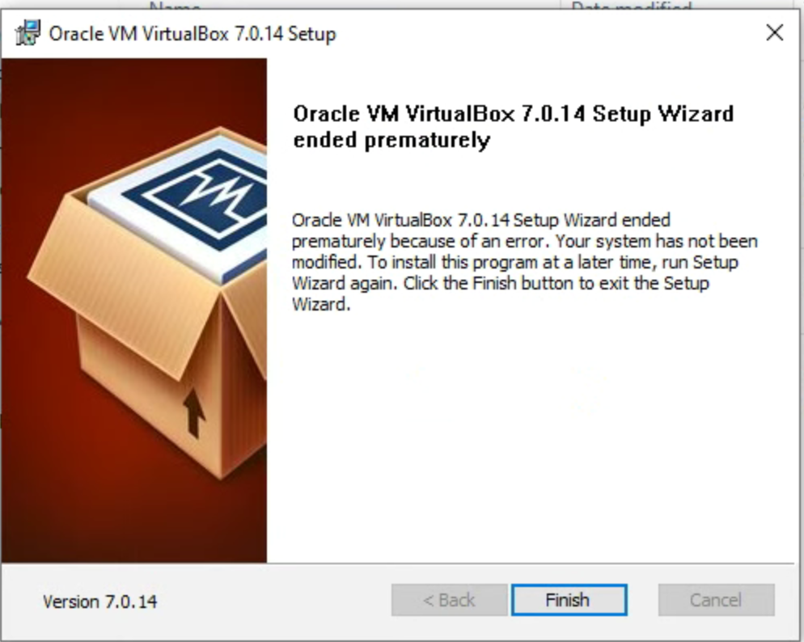
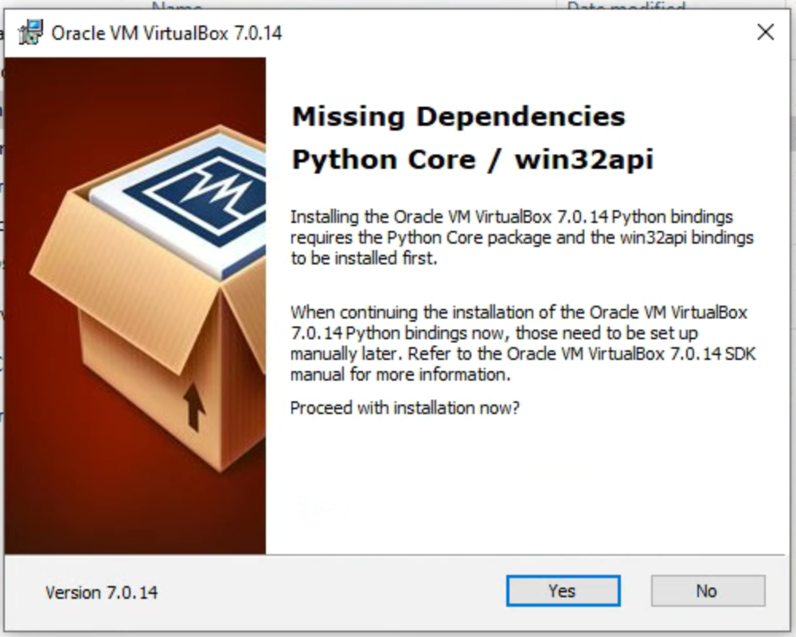
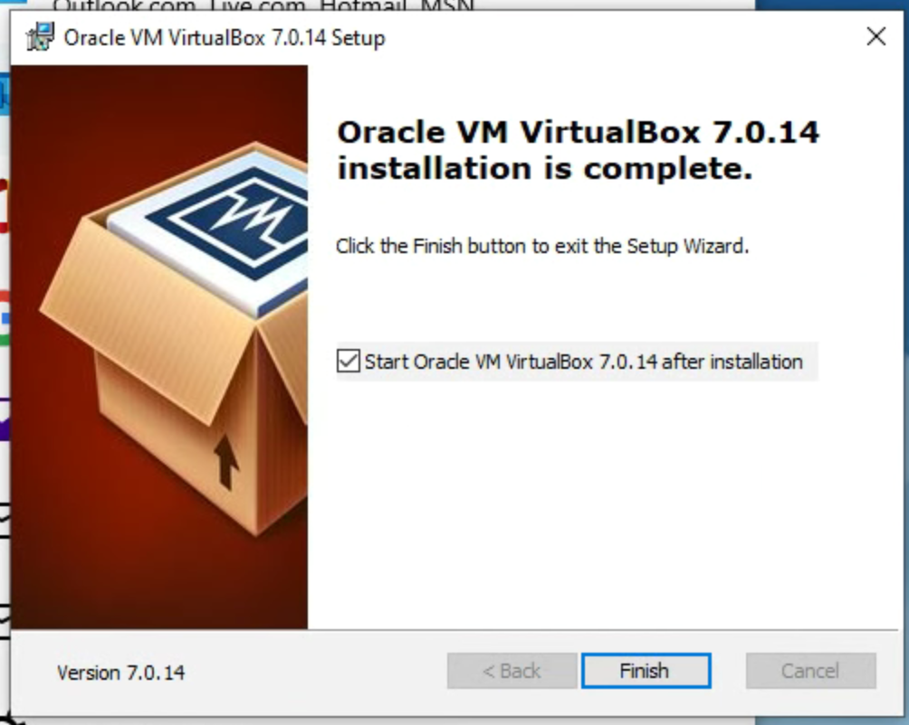
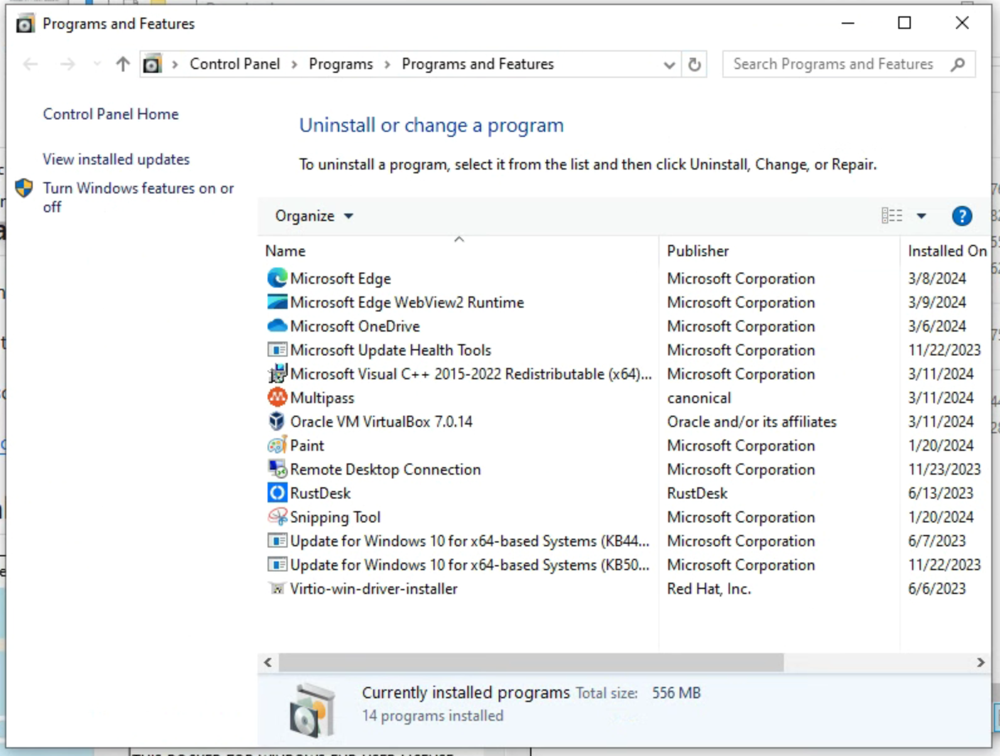

# Pre Requisitos.

Como tenemos una restricción por el lado de AWS, vamos a asumir que el lab se hace en tu ordenador, para ello, debemos tener Virtualbox y Multipass (aunque docker desktop podría servir inicialmente, el manejode clusters es más fácil con estos dos).


## 1. Instalando Virtualbox.

Para el hipervisor, vamos a usar Virtualbox, y como de seguro tienes un ordenador con Windows, aquí lo puedes instalar:

[Para Windows](https://download.virtualbox.org/virtualbox/7.0.14/VirtualBox-7.0.14-161095-Win.exe)

Cuando lo instale yo, me salía este error:




Si te sale, debes instalar este paquete de Visual Studio C++:
[Libreria Visual Studio](https://aka.ms/vs/17/release/vc_redist.x64.exe)


Y ahora si podemos instalar el virtualbox:







Y listo, ya tenemos instalado el virtualbox:


## 2. Instalando MultiPass.

Ahora vamos a descargar el multipass para windows: [Descargar aquí](https://multipass.run/download/windows)


Al momento de esta ventana, debemos seleccionar: **Oracle VM Virtualbox**:


Y si abres el panel de aplicaciones instaladas en windows, veras los dos componentes ya en el sistema:



## 3. Instalando docker (OPCIONAL).

Para los ejercicios introductorios, vamos a ver como funcionan los contenedores, por ende se pone opcional el uso de docker desktop.


Y comprobando que funcione:

`docker run --rm alpine echo "Hola mundo"`

## 4. Usando Docker Compose (OPCIONAL).

`docker-compose up -d`

<!-- ## 3. Instalando MiniKube

Primero vamos a descargar e instalar el binario según sea nuestra plataforma:[MacOS, Linux, Windows](https://minikube.sigs.k8s.io/docs/start/)


Luego de esto vamos a iniciar minikube:

`minikube start`

Y vamos a instalar kubectl: 

`minikube kubectl -- get po -A`

Si el comando anterior no funciona, debes instalarlo manualmente: 

[Click aquí](https://kubernetes.io/docs/tasks/tools/#kubectl)

Y si todo salio bien, vamos a comprobar:

```
kubectl config current-context 
minikube
```

Podemos ir a `minikube dashboard` para ver la interfaz gráfica que honestamente, nadie usa:

 -->